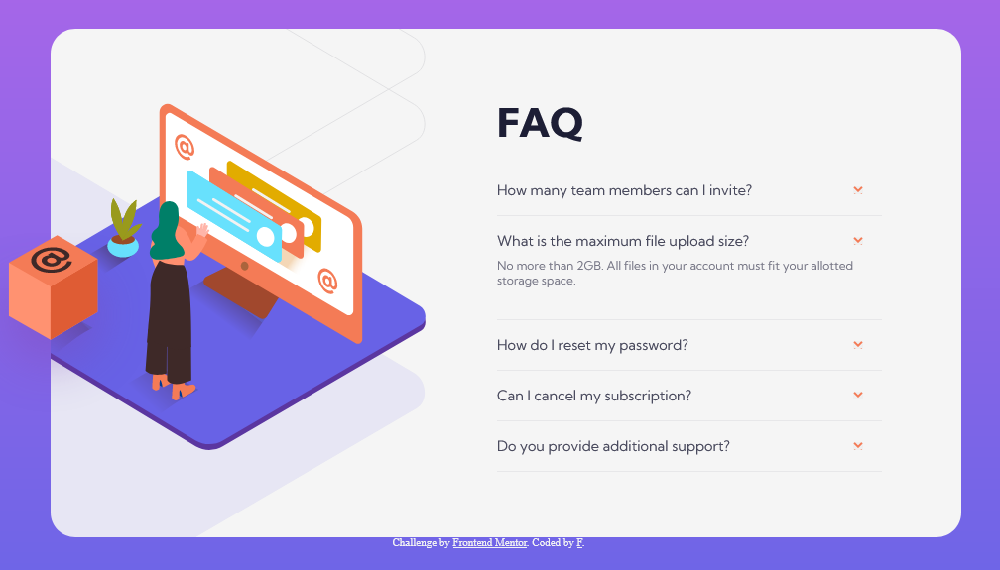

# Frontend Mentor - FAQ accordion card [solution](https://nottohave.github.io/faq-accordion-card/)

## Table of contents

- [Overview](#overview)
  - [The challenge](#the-challenge)
  - [Screenshot](#screenshot)
  - [Links](#links)
- [My process](#my-process)
  - [Built with](#built-with)
  - [What I learned](#what-i-learned)
  - [Continued development](#continued-development)
  - [Useful resources](#useful-resources)
- [Author](#author)
- [Acknowledgments](#acknowledgments)

## Overview

### The challenge

Users should be able to:

- View the optimal layout for the component depending on their device's screen size
- See hover states for all interactive elements on the page
- Hide/Show the answer to a question when the question is clicked

### Screenshot



### Links

- Solution URL: [Solution](https://www.frontendmentor.io/solutions/html-css-js-AsqzV-T1d)
- Live Site URL: [Live](https://nottohave.github.io/faq-accordion-card/)

## My process

### Built with

- Semantic HTML5 markup
- CSS custom properties
- Flexbox
- Mobile-first workflow

### What I learned

Practice my CSS and HTML5 skills.
CSS: flexbox, active, hover element, design from mobile view to desktop view.
Javascript: practice some ES6, and access to HTML DOM elements (document.querySelector and ele.style.display)

This is my highlight of learning - I look up on Frontend Slack community to learn how to add active element to a click event.
```js
// Add and remove active class when clicked
buttons.forEach(button => {
    button.addEventListener("click", function() {
        buttons.forEach(function(btn) {
            btn.classList.remove('active');
        });

        button.classList.add("active");
    })
})
```

## Author

- Frontend Mentor - [@nottohave](https://www.frontendmentor.io/profile/nottohave)
- Twitter - [@Ubering_Cacti](https://twitter.com/Ubering_Cacti)

## Acknowledgments
[@mattstuddert](https://www.frontendmentor.io/profile/mattstuddert) from FrontendMentor for providing me a simple solution to show/hide elements.